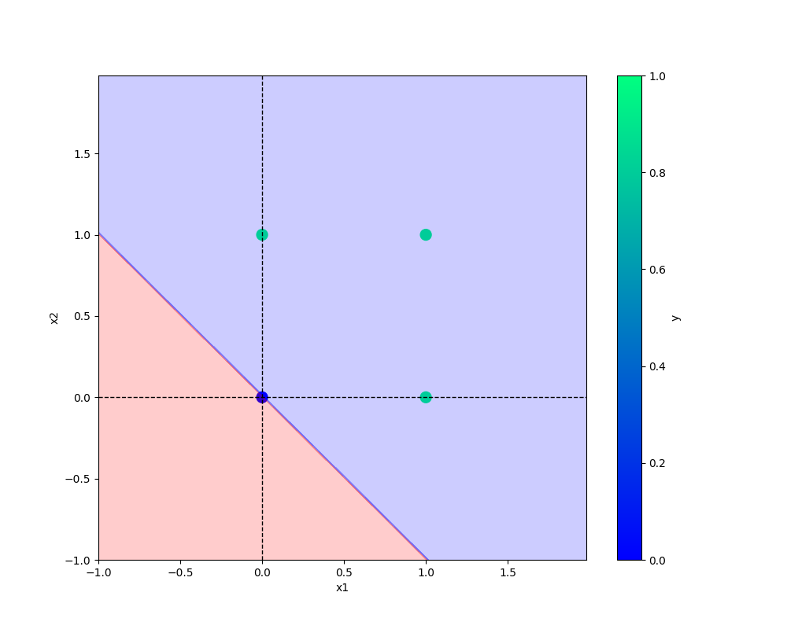

# oneNeuron
oneNeuron | Perceptron

## commands used - 

```bash
git add . && git commit -m "first commit" && git push origin main
```

## Add a url -
[Git handbook](https://guides.github.com/introduction/git-handbook/)

## Add an image -
